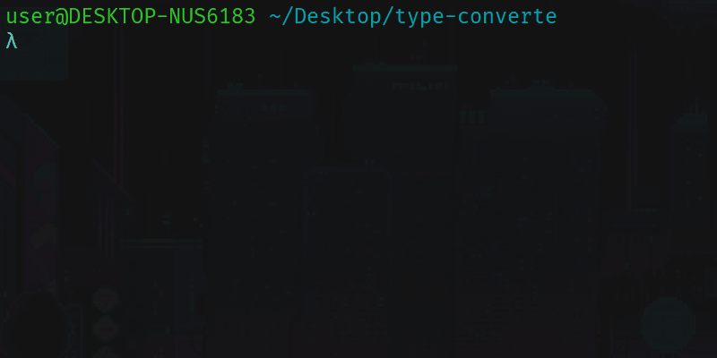

# ConvertType

## Description

Application that creates an interactive CLI to convert files.



#

## Tech's

  - **Typescript** :large_blue_circle:.
  - **InquirerJS** :man_technologist:.
  - **ImageMagick** :high_brightness:.

## Get started

1 - Install the necessary dependencies

```bash
  npm install
```
or 
 
```bash
  yarn install
```
 
2 - Run the command to start the CLI

```bash
  npm run start
```

or 

```bash
  yarn start
```

## Using

After installing the necessary dependencies, and starting the CLI, inform the `absolute path` of the folder where the files are, and choose where the new files will be saved.

If you wanted it is possible to configure a default path where the files are and a default path where they will be saved, in the file `defaultOptions.ts`.
